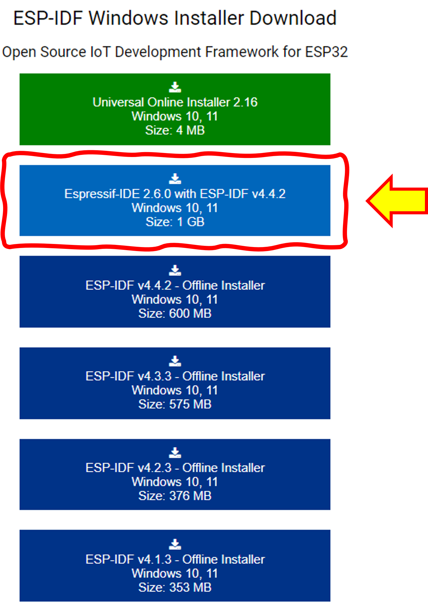

# ESP-IDF Tool 
 
IDF ย่อมาจาก IoT Development Framework เป็น framework สำหรับพัฒนา IoT ที่ดูแลโดย  Espressif ที่เป็นผู้ผลิตชิบ ESP32 ซึ่งปัจจุบันมีออกมาหลายรุ่น ได้แก่ ESP32, ESP32-S, ESP32-C และ ESP32-H
ศึกษารายละเอียดเพิ่มเติมได้จาก https://www.espressif.com/en/products/sdks/esp-idf

## การติดตั้งเครื่องมือพัฒนา IoT  บน ESP32

1. Download ไฟล์ติดตั้งจาก https://dl.espressif.com/dl/esp-idf/

เลือก Espressif-IDE x.x.x with ESP-IDF vx.x.x เพื่อติดตั้งทั้ง IDE  และ ESP-IDF

- IDE ที่ติดตั้งจะเป็น IDE ที่พัฒนามาจากโปรแกรม editor ที่ชื่อ Eclipse มีความสามารถในการทำงานกับโปรเจคในภาษาต่างๆ รวมทั้งทำงานร่วมกับ git ซึ่ง Espressif ได้รวมเอาความสามารถเหล่านั้นไว้ใน Espressif-IDE เรียบร้อยแล้ว (และเราก็สามารถติดตั้ง plugins ของ Eclipse เพิ่มเติมได้ตามต้องการ)
- ESP-IDF  ย่อมาจาก ESP IoT Development Framework เป็น framework ที่รวมเอาชุดพัฒนาในภาษา C/C++ ทั้ง compiler, linker, locator และ script ต่างๆ เพื่อการดึง Library ต่างๆ มาร่วมทำงานบน IDE

## ขั้นตอนการติดตั้ง

1. เมื่อ download ไฟล์มาแล้ว ให้เรียกขึ้นมาทำงาน

2. จะปรากฏหน้าจอ License Agreement ให้อ่านทำความเข้าใจ ถ้ายอมรับให้เลือก I accept the agreement. แล้วคลิกปุ่ม Next

3. ตัวติดตั้งจะตรวจสอบความพร้อมของระบบและสภาพแวดล้อมของเครื่องคอมพิวเตอร์ที่จะติดตั้ง (Pre-installation system check) และรายงานออกมา ถ้ามีบางอย่างที่ไม่เข้ากัน (สังเกตุจากปุ่ม Apply Fixed จะ Active) ให้กดปุ่ม Apply Fixed เพื่อให้ตัวติดตั้งทำการปรับปรุงระบบให้เหมาะกับการติดตั้ง ซึ่งอาจจะต้องให้ผู้ใช้อนุญาตการกระทำนั้น ให้ตอบตกลงในกรณีที่มีหน้าจอขออนุญาตแสดงขึ้นมา จากนั้นกดปุ่ม `Next` เพื่อดำเนินการขั้นถัดไป

4. ตัวติดตั้งจะถามตำแหน่งที่ต้องการติดตั้ง ในกรณีที่เป็นคอมพิวเตอร์ส่วนบุคคล อาจจะติดตั้งในตำแหน่งที่ตัวติดตั้งกำหนดไว้เป็นค่าเริ่มต้น แต่ถ้าใช้เครื่องคอมพิวเตอร์ส่วนรวมหรือมีเนื้อที่ในไดรว์ C ไม่เพียงพอ อาจจะต้องเลือกตำแหน่งสำหรับติดตั้งที่เหมาะสม จากนั้นกดปุ่ม `Next` เพื่อดำเนินการขั้นถัดไป 

