# ESP-IDF Tool 

## ขั้นตอนการติดตั้ง

1. เมื่อ download ไฟล์มาแล้ว ให้เรียกขึ้นมาทำงาน

2. จะปรากฏหน้าจอ License Agreement ให้อ่านทำความเข้าใจ ถ้ายอมรับให้เลือก I accept the agreement. แล้วคลิกปุ่ม Next เพื่อดำเนินการขั้นถัดไป

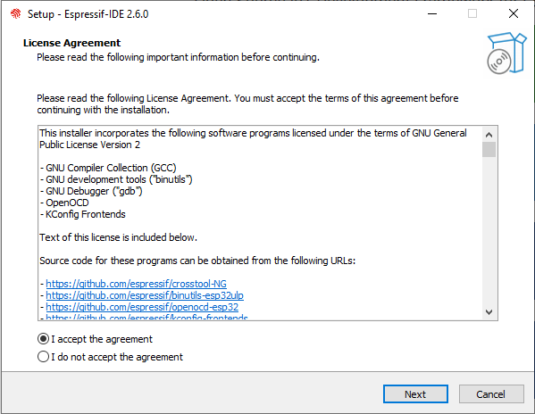

3. ตัวติดตั้งจะตรวจสอบความพร้อมของระบบและสภาพแวดล้อมของเครื่องคอมพิวเตอร์ที่จะติดตั้ง (Pre-installation system check) และรายงานออกมา ถ้ามีบางอย่างที่ไม่เข้ากัน (สังเกตุจากปุ่ม Apply Fixed จะ Active) ให้กดปุ่ม Apply Fixed เพื่อให้ตัวติดตั้งทำการปรับปรุงระบบให้เหมาะกับการติดตั้ง ซึ่งอาจจะต้องให้ผู้ใช้อนุญาตการกระทำนั้น ให้ตอบตกลงในกรณีที่มีหน้าจอขออนุญาตแสดงขึ้นมา จากนั้นกดปุ่ม `Next` เพื่อดำเนินการขั้นถัดไป

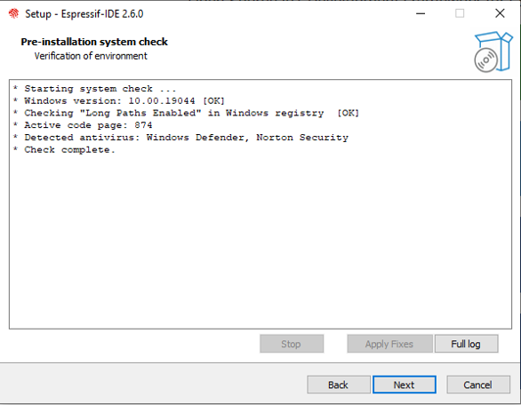

4. ตัวติดตั้งจะถามตำแหน่งที่ต้องการติดตั้ง ในกรณีที่เป็นคอมพิวเตอร์ส่วนบุคคล อาจจะติดตั้งในตำแหน่งที่ตัวติดตั้งกำหนดไว้เป็นค่าเริ่มต้น `(C:\Epressif)` แต่ถ้าใช้เครื่องคอมพิวเตอร์ส่วนรวมหรือมีเนื้อที่ในไดรว์ C ไม่เพียงพอ อาจจะต้องเลือกตำแหน่งสำหรับติดตั้งที่เหมาะสม จากนั้นกดปุ่ม `Next` เพื่อดำเนินการขั้นถัดไป 

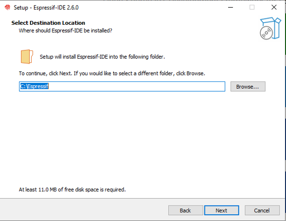

5. ตัวติดตั้งจะถามรูปแบบการติดตั้งที่ต้องการ หากมีเนื้อที่เพียงพอ แนะนำให้เลือกแบบ Full installation แต่ถ้าต้องการประหยัดพื้นที่ ก็อาจจะเลือก Minimal installation หรืออาจจะกำหนดองค์ประกอบที่ต้องการเอง (Customize installation) เสร็จแล้วกดปุ่ม `Next` เพื่อดำเนินการขั้นถัดไป

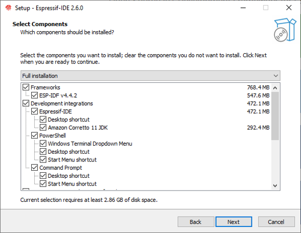

6. ตัวติดตั้งจะรายงานรายการที่จะทำการติดตั้ง โดยแจ้งว่า Ready to Install ในขั้นนี้ ถ้าพร้อมจะติดตั้ง ไม่มีสิ่งใดต้องการแก้ไข ก็ให้กดปุ่ม `Next` เพื่อติดตั้ง (ซึ่งหลังจากนี้จะเป็นการดำเนินการโดยตัวติดตั้งจนเสร็จ ไม่สามารถย้อนกลับได้)

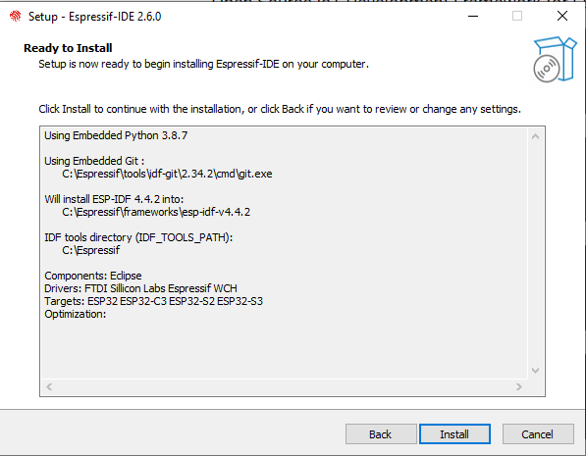

7. ตัวติดตั้งจะเตรียมการติดตั้ง

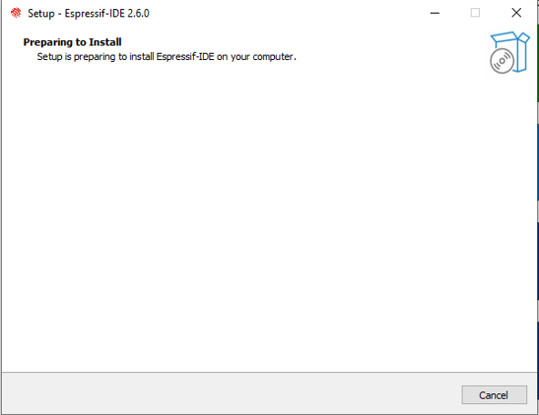

8.  ตัวติดตั้งดำเนินการติดตั้ง อาจจะมีกล่องโต้ตอบเพื่อขออนุญาตแก้ไขระบบ ถ้าพิจารณาแล้วไม่เกิดปัญหา ให้อนุญาตให้ตัวติดตั้งทำการปรับปรุงระบบ

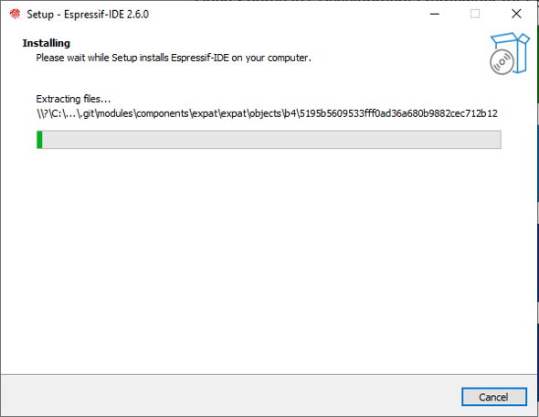

9. เมื่อติดตั้งเรียบร้อย ตัวติดตั้งจะทำการกำหนด python environment ที่จะช่วยในการ build firmware binary จาก project ที่เราสร้าง

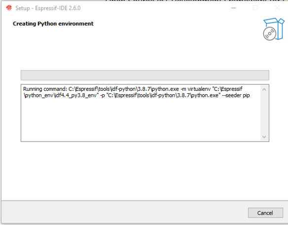

10. การติดตั้งเรียบร้อย ตัวติดตั้งให้โอกาสในการตั้งค่า Environment ของระบบเพื่อให้สามารถเรียกใช้ซอฟต์แวร์ได้จาก command line ถ้าต้องการให้ติ๊กตัวเลือก `Run ESP-IDF PowerShell Environment` และ `Run ESP-IDF Command Prompt Environment` กดปุ่ม `Next` เพื่อดำเนินการขั้นถัดไป
     

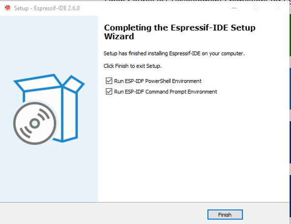

11.  จะปรากฏหน้าจอ `ESP-IDF 4.4 CMD` เมื่อรันจนปรากฏข้อความ `C:\......\esp-idf-v4.4.2` แล้ว สามารถปิดหน้าต่างนี้ได้ 

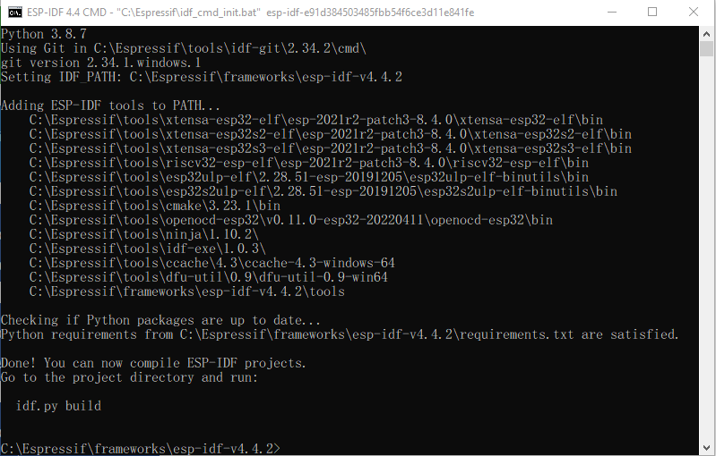

12.  จะปรากฏหน้าจอ `ESP-IDF 4.4 PowerShell` เมื่อรันจนปรากฏข้อความ `PS C:\......\esp-idf-v4.4.2` แล้ว สามารถปิดหน้าต่างนี้ได้ 

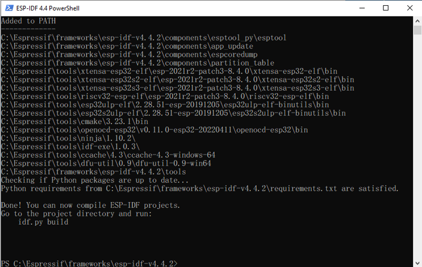

13. ถ้าการติดตั้งทุกอย่างเป็นไปด้วยความเรียบร้อย จะมีซอฟต์แวร์ของ Espressif ติดตั้งบนเครื่อง สามารถเรียกใช้งานได้จากไอคอนด้านล่างนี้

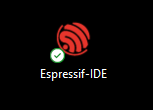

